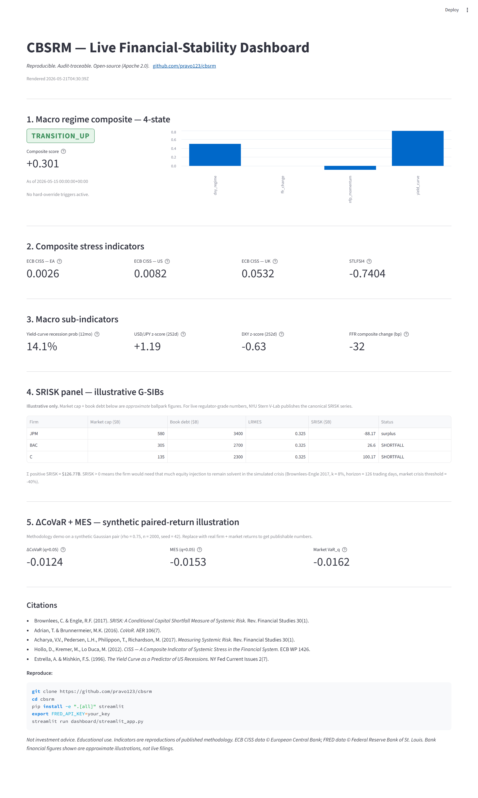

# CBSRM Live Dashboard

A single-page Streamlit demo of the CBSRM v0.5 public API. Renders the
4-state macro regime, ECB CISS + STLFSI4 stress readings, yield-curve recession
probability, USD/JPY + DXY regimes, FFR change, SRISK for three illustrative
G-SIBs, and a synthetic-paired-return ΔCoVaR / MES illustration — all from the
installed `cbsrm` package.

## 5-second start

```bash
git clone https://github.com/pravo123/cbsrm
cd cbsrm
pip install -e ".[all]" streamlit
export FRED_API_KEY=your_free_fred_key   # https://fred.stlouisfed.org/docs/api/api_key.html
streamlit run dashboard/streamlit_app.py
```

The dashboard listens on `http://localhost:8501` by default and renders all
panels in under ~30 seconds on first load (cached on refresh).

## Screenshot



> If the screenshot is a placeholder, take one yourself: launch the dashboard
> as above, wait for it to render, then capture the browser viewport
> (`PrintScreen` / `Cmd+Shift+4`) into `dashboard/screenshot.png`.

## What this is — and isn't

**It is** a demo artifact: methodology preview, screenshot fodder, README eye
candy. Every number is computed from the same public CBSRM classes the CLI
uses; you can re-run any panel from `examples/quickstart.py` and get matching
results.

**It is not** production monitoring, an order-entry surface, an API, or
investment advice. The SRISK panel uses *approximate* market-cap and book-debt
figures for JPM, BAC, and C — clearly labeled as illustrative. For
regulator-grade live numbers, consult NYU Stern V-Lab.

## Crisis Dossier Viewer (v0.8, offline)

A second standalone Streamlit page lives at
[`crisis_dossier_viewer.py`](crisis_dossier_viewer.py). It renders the
deterministic v0.8 crisis-window dossiers (`2008Q4`, `2020Q1`, `2023Q1`)
through the canonical report renderer and offers Markdown / JSON downloads.
No FRED key, no network calls, no API server required.

```bash
pip install -e ".[all]" streamlit
streamlit run dashboard/crisis_dossier_viewer.py
```

Mirrors the CLI surface (`cbsrm crisis-dossier WINDOW --format ...`) and the
FastAPI surface (`GET /reports/crisis-dossiers/...`) bit-for-bit — all three
front-ends share the same `cbsrm.diagnostics.build_crisis_dossier` +
`cbsrm.reporting` payload/renderer composition.

## License

Apache 2.0. Same as the rest of CBSRM.
